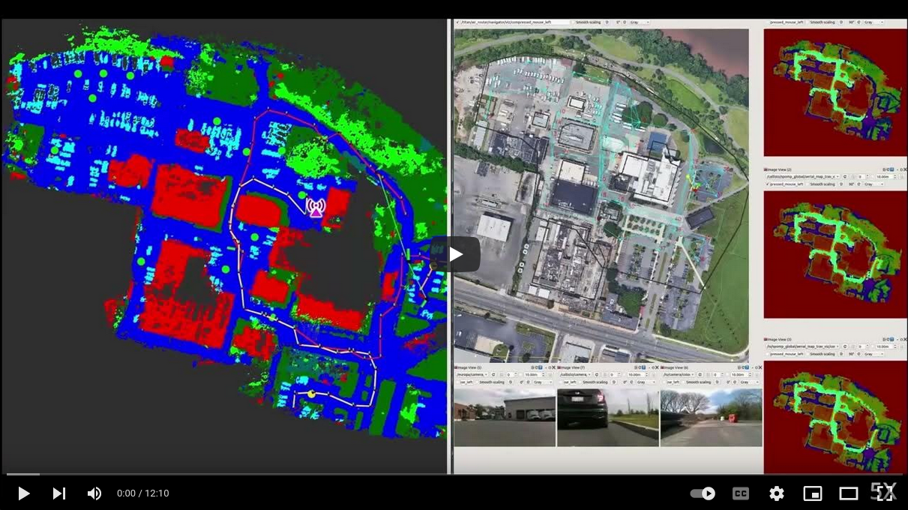

# SPOMP: Semantic Panoramic Online Mapping and Planning


This is the public code repository for our work SPOMP.
Here are all the submodules needed for the stack.

## Video

[](https://www.youtube.com/watch?v=jcPOVRsdUhU)

## Paper
IEEE T-FR: [https://doi.org/10.1109/TFR.2024.3424748](https://doi.org/10.1109/TFR.2024.3424748)
arXiv: [https://doi.org/10.48550/arXiv.2407.09902](https://doi.org/10.48550/arXiv.2407.09902)

Citation:
```
@ARTICLE{10587299,
  author={Miller, Ian D. and Cladera, Fernando and Smith, Trey and Taylor, Camillo Jose and Kumar, Vijay},
  journal={IEEE Transactions on Field Robotics}, 
  title={Air-Ground Collaboration with SPOMP: Semantic Panoramic Online Mapping and Planning}, 
  year={2024},
  volume={},
  number={},
  pages={1-1},
  keywords={Semantics;Laser radar;Task analysis;Planning;Robot sensing systems;Sensors;Three-dimensional displays},
  doi={10.1109/TFR.2024.3424748}}
```

## How to run the code?
We provide Docker images that can be used to run this code:
```
# Clone and run the master docker image
git clone https://github.com/KumarRobotics/dcist_master.git
cd dcist_master
./run.bash dcist-master

# Clone the repo and build
cd user_ws
mkdir src
git clone --recursive -j8 https://github.com/KumarRobotics/spomp-system.git src/spomp-system
catkin config --extend ~/dcist_ws/devel && catkin build -DCMAKE_BUILD_TYPE=Release
```

Launch files for air and ground robots can be found inside `semantics_manager`.

## Main modules

- [semantics_manager](http://github.com/KumarRobotics/semantics_manager): Starting point for launch files and configuration management
- [ROFL](https://github.com/versatran01/rofl-beta): LiDAR odometry
- [SPOMP](http://github.com/KumarRobotics/spomp): Autonomy stack for UGVs.  Handles terrain analysis and global and local planning.
- [ASOOM](http://github.com/KumarRobotics/asoom): Aerial orthomapper
- [top_down_renderer](https://github.com/KumarRobotics/top_down_renderer): Crossview localizer
- [air_router](https://github.com/KumarRobotics/air_router): High-level planner for UAV
- [MOCHA](http://github.com/KumarRobotics/MOCHA): Distributed, opportunistic communication framework

## Dependencies

- [grid_map](https://github.com/KumarRobotics/grid_map): Fork of grid_map with resizing and compression capabilities
- [orbslam3_ros](https://github.com/iandouglas96/orbslam3_ros/): ROS wrapper for ORBSLAM3
- [erfnet_pytorch_ros](https://github.com/iandouglas96/erfnet_pytorch_ros): ROS wrapper for erfnet (for aerial image segmentation)
- [rangenet_inf](https://github.com/KumarRobotics/rangenet_inf): ROS wrapper for RangeNet++ (for depth panorama segmentation)
- [ouster_decoder](https://github.com/KumarRobotics/ouster_decoder): Ouster LiDAR driver (needed for ROFL)
- [ORB_SLAM3](https://github.com/KumarRobotics/ORB_SLAM3): Fork of ORB_SLAM3 with loop closure deactivated.

## Tools
These are not needed to run the stack, but may be useful.

- [SILL](https://github.com/iandouglas96/sill): Depth panorama/LiDAR labelling tool
- [rviz_textured_quads](https://github.com/lucasw/rviz_textured_quads) Useful tool for visualizing map images in rviz
